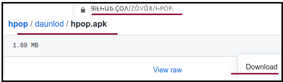

# **[daunlod](./daunlod/)** me zakr hpop5210.apk pr klik kre. **[डाउनलोड](./daunlod/)** में जाकर hpop5210.apk पर क्लिक करें।

[hpop5210.apk . कैसे डाउनलोड करें के लिए वीडियो hpop5210.apk kAise daunlod kre ke liye vidio](https://youtu.be/hHlG011mZc8)

1. fir Apne mobile ke folders me zae Aur Download folder me hpop5210.apk ko click/dbl_klik krke instal krna shuru kre.फिर अपने मोबाइल के फोल्डर में जाएं और डाउनलोड फोल्डर में hpop5210.apk इंस्टॉल करना शुरू करने के लिए क्लिक/डबल_क्लिक करें।

1. open kre.
    1. st input mATHAd btn klik kre
    2. **hpop5210** selekt kre

1. **[google play store me zae Aur zFont 3](https://play.google.com/store/apps/details?id=com.htetznaing.zfont2)** search kre Aur **install** kre.

1. [cms](./cms/ folder me zae Aur **lato5r.ttf pr klik krke daunload kre** , sev kre , Aur Download folder me lato5r.ttf ko check krle ki ye daunlod ho gyi kya. ye Apne ap **zFont 3** ke saTh khulegi.
       1. "set" button Dbae , Apne phone ka model select kre
       2. method 1 (old) select kre. ok Dbae. Font pez khul zaega.
       3. system font me zae Aur lato5r pr klik kre.
       4. Apply btn klik kre.
       5. reboot btn klik kre.

## Ab apke phone me hpop5210 keyboard ke saTh lato5r.ttf instal ho gye h

### [hex nmbrs : 0123456789LJQWXF](http://github.com/zava8/hex) mlyalm Telugu hinDi guzraTi mrathi bNgali pnzabi urDu knrra Tmil

[zinglish for :](http://zinglish.vercel.app)
    1. hinDi / mrathi / nepali / grrvali / urDu
    2. Telugu / knrra / Tullu
    3. Tmil
    4. mlyalm
    5. guzraTi
    6. mrathi
    7. bNgali / baNgla
    8. urriya
    9. pnzabi / gurumukhi

## heksa_bin binary f/f% kmpliit digital mAThs :- 
> **it siims vi shud kaunt on phiNgArs & yuj Thmbs tu sho & haid.**

photos & qnimesqns bilo

[vidiolist](https://www.youtube.com/playlist?list=PLlYCdgTLt8n9FbT69DieXkc00VdW3wa1W)
[hbord vidio](https://youtu.be/VogKRvYheDM)
[heksmqxhs2 giphyvidio](https://giphy.com/gifs/SuBYdWOLQraLIEALbp/html5)

haski_8_10 midori braujr project viwh heksifglish button "h"  
midori braujr viwh heksifglish button vith 'h' label.  
vhen user press this button , tekst on current vebpage gets changed as in bilo steps :
1. all capital case gets changed to small case:  A-Z -> a-z   ( like cntr+u in notepad++) 
2. all f, q, w, x, z gets changed as :     f->ph , q->k , w -> v , x->qks, z->j
3. all :;&lt;=&gt;? gets changed as  : -&gt; A , ; -&gt; B , &lt; -&gt; C , = -&gt; D , &gt; -&gt; E , ? -&gt; F
4) page gets refreshed but phonts gets changed to roboto810s.ttf

###### mintos minu tri os:  
1. onli phur smal_kes roboto_heks_jk/zk/jq/zq phonts heksifglish
2. minu kiij tu suport mintos ( minu tri opretifg sistm)
 1. phfksnl minu ki
 2. objqkt minu ki
3. qndqrskor is gud phur programifg. kqmql_kes & qpqr_kes not gud
4. GZ not weyr. riplesd bai gud simbqls phur modqrn programifg lqfgyuejis laik html5 javaskript templet_programifg
5. heksadesiml nmbrs

### reletid liNks
1. [gitHb ripojitri](http://github.com/Font77/hpop5210)
2. [roboto phonts daunlod qur instal kre][roboto heksbin phonts]
3. [vk](http://vk.com/etphor)
4. [tmblr](http://heksinglish.tumblr.com)
5. [liNkdin](http://linkedin.com/in/vnti10vnso100)
6. [sos](http://en.wikipedia.org/wiki/Subject%E2%80%93object%E2%80%93verb)
7. [blogspot](http://heksadesiml.blogspot.com)
8. [rAdit](http://reddit.com/user/heksadesiml)
9. [lifkdin artikl](https://www.linkedin.com/pulse/kibord-leaut-phur-heksaikod-vnti-heksinglish)

### giphs
1. 8bit vayr  

2. 
3. 
4. [hekskaunt](https://photos.app.goo.gl/wGSzsBxjmJjFAbAm9)  
5. 
6. siks heksifglish midiAm  

7. heksadesiml taim

8. et hrignomtri

9. hesbin cart
[iot maths](https://heksinglish.tumblr.com/post/629519441992007680/iot-maths-mathematics-future-technology)

### kontAkt mi
2. [fb vnti10](fb.me/vnti10)
3. [m vnti10](m.me/vnti10)

#### rephrens lifks:  
[cms]: ./cms/
[hpop5210_heks.apk]: https://github.com/Font77/heks810/blob/master/hpop5210_heks.apk

font **fontforge** 